# MLOps Zoomcamp Homeworks - Week 02a (Weights & Biases)

## Question 1

Installing wandb

```sh
pip install wandb
wandb --version
```
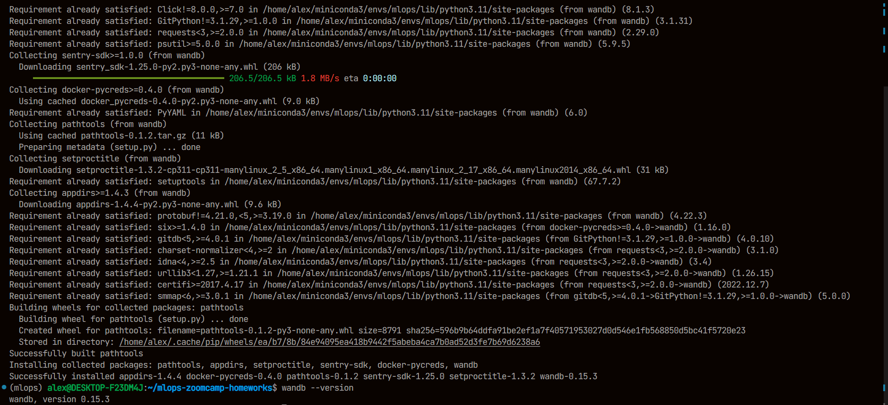

*Answer:* wandb version is 0.15.3

## Question 2

```sh
wget -P ./data https://d37ci6vzurychx.cloudfront.net/trip-data/green_tripdata_2022-{01,02,03}.parquet
python preprocess_data.py \
  --wandb_project mlops_zoomcamp_w02 \
  --wandb_entity alex-fedorenko \
  --raw_data_path ./data \
  --dest_path ./output
```
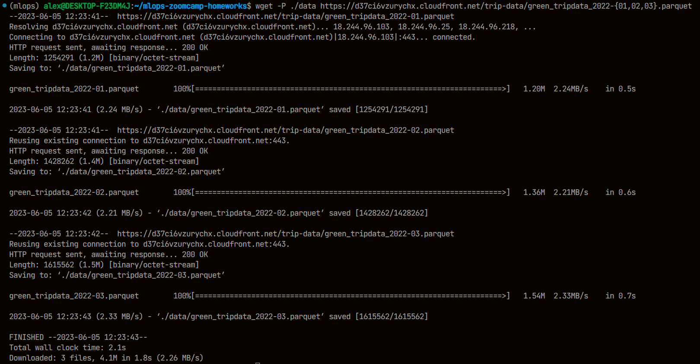
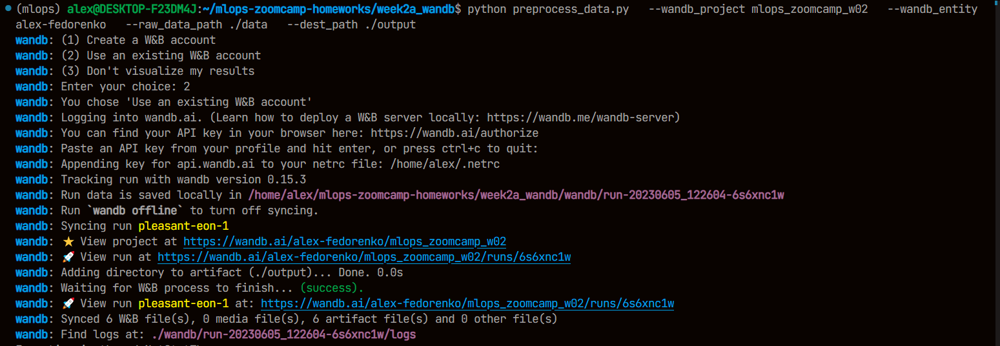
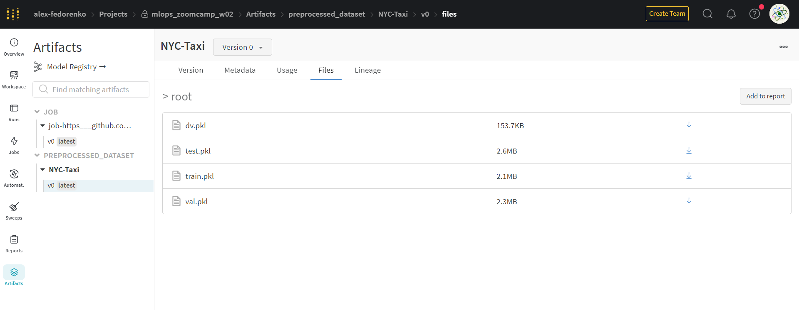

*Answer:* 153.7 kB

## Question 3

```
python train.py \
  --wandb_project mlops_zoomcamp_w02 \
  --wandb_entity alex-fedorenko \
  --data_artifact "alex-fedorenko/mlops_zoomcamp_w02/NYC-Taxi:v0"
```
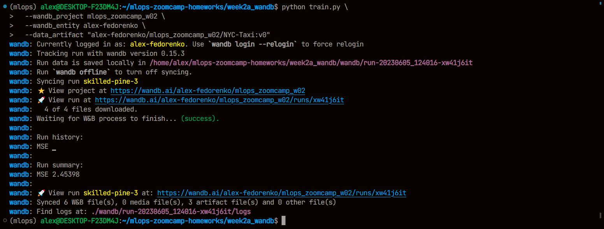
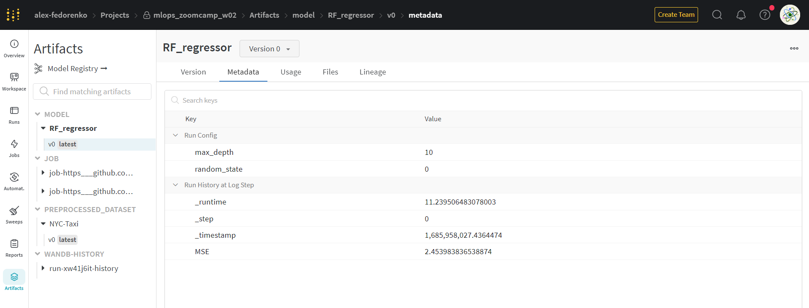

*Answer:* max_depth is 10

## Question 4

```
python sweep.py \
  --wandb_project mlops_zoomcamp_w02 \
  --wandb_entity alex-fedorenko \
  --data_artifact "alex-fedorenko/mlops_zoomcamp_w02/NYC-Taxi:v0"
```
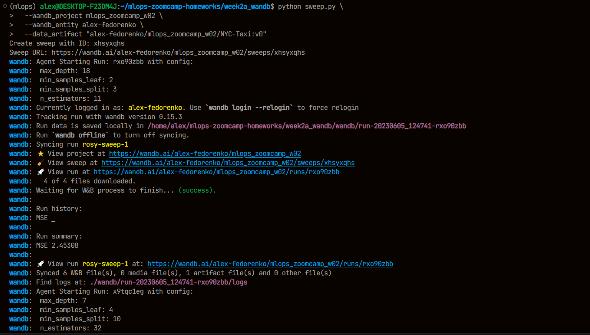
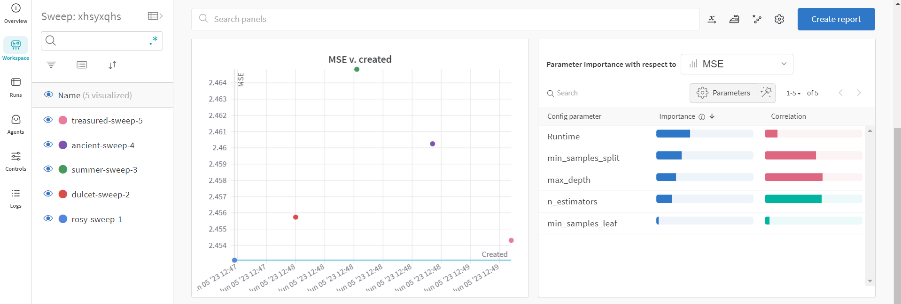
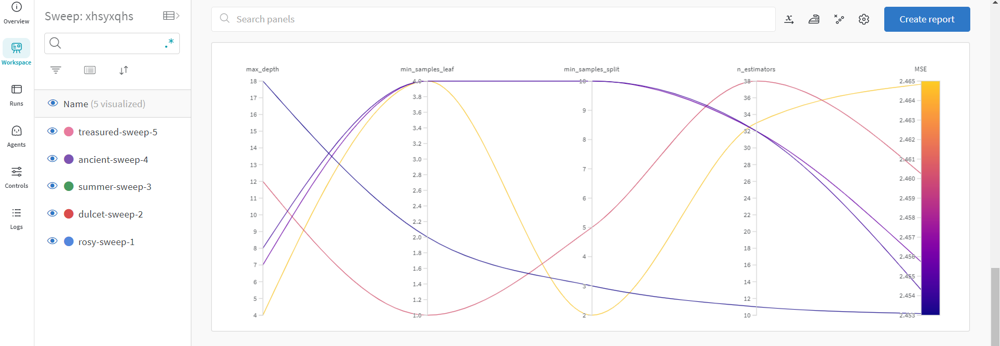

*Answer:* most important parameter is `min_samples_split`

## Question 5

Here we create a registered model

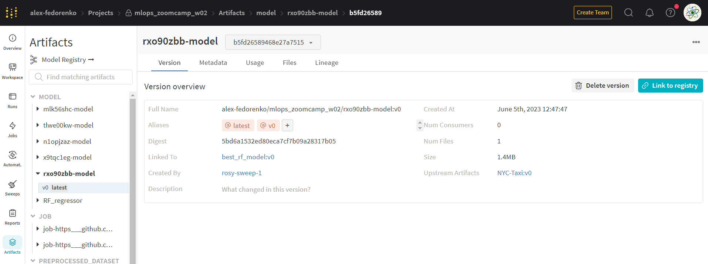
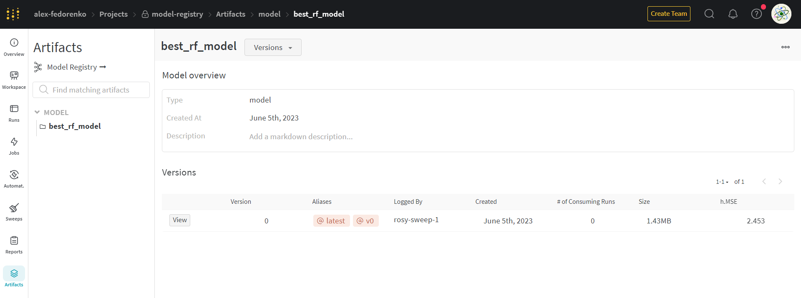

*Answer:* after linking best model we can see all the information from the question