# MLOps Zoomcamp Homeworks - Week 03 (Prefect)

## Question 1

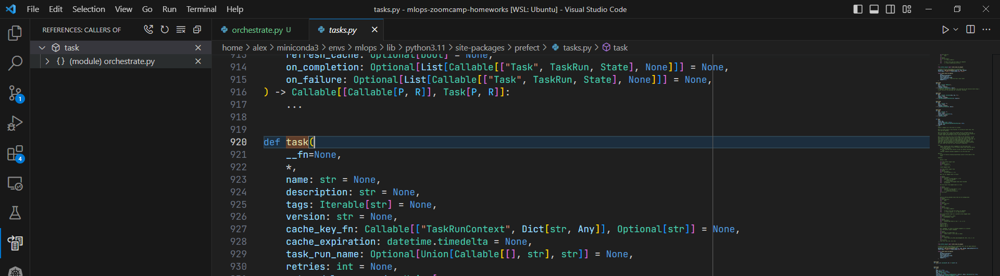
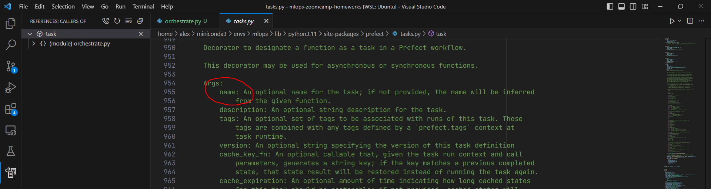

Answer: `@task(retries=3, retry_delay_seconds=2, name="Read taxi data")`

## Question 2

```
prefect server start
prefect deployment build --name nyc-taxi-experiment --cron "0 9 3 * *" orchestrate.
py:main_flow
prefect deployment apply main_flow-deployment.yaml

```
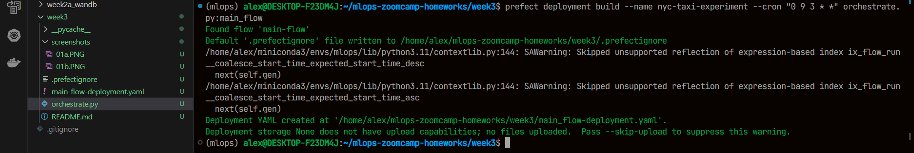
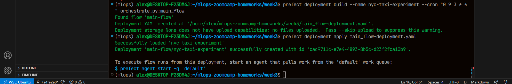
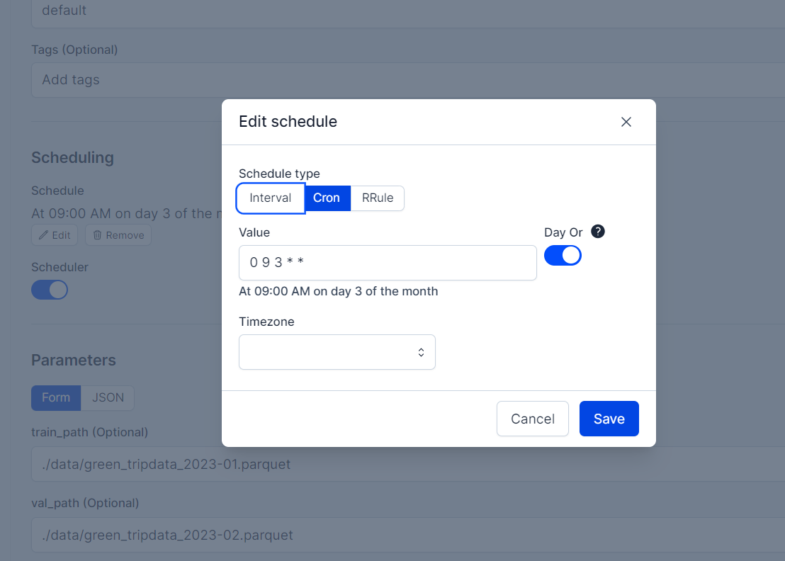

Answer: "0 9 3 * *"

## Question 3

```
wget -P ./data https://d37ci6vzurychx.cloudfront.net/trip-data/green_tripdata_2023-{01,02}.parquet

prefect agent start -q 'default'

```
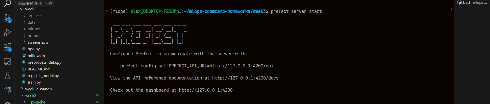
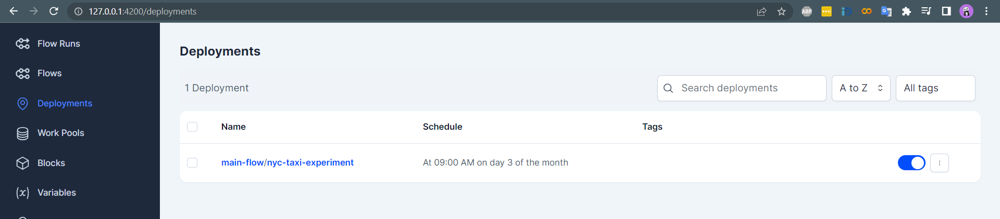
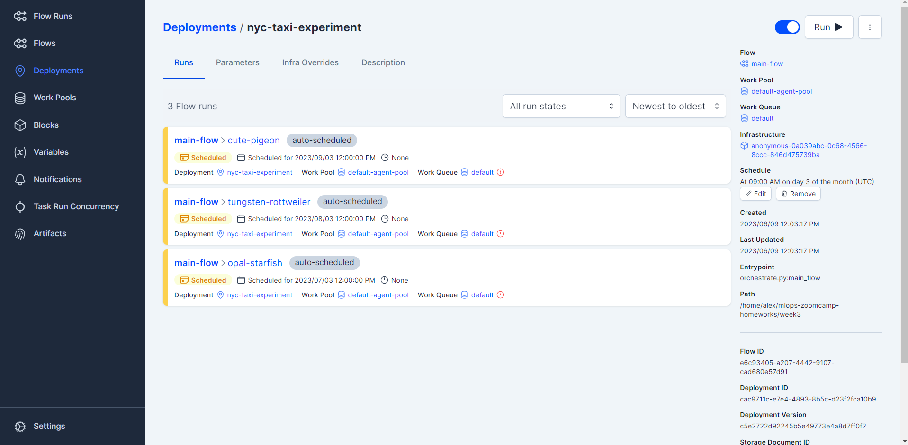
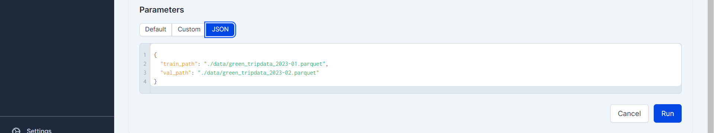
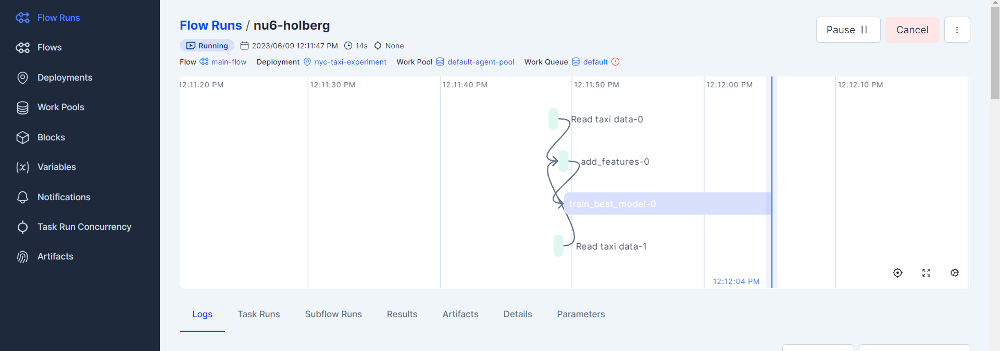

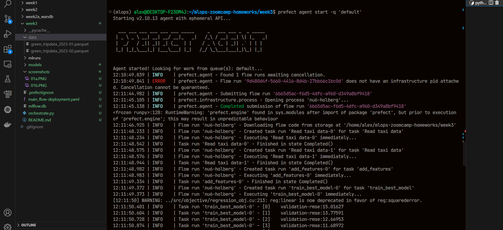
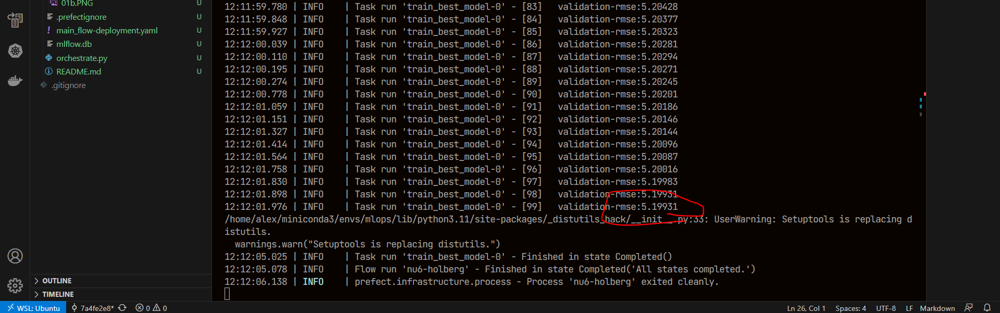

Answer: 5.19931

## Question 4

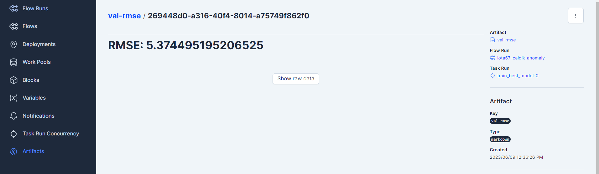

Answer: 5.37

## Question 5

```
prefect block register -m prefect_email

```
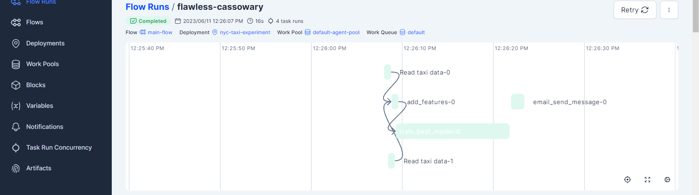

Answer: `email_send_message`

## Question 6

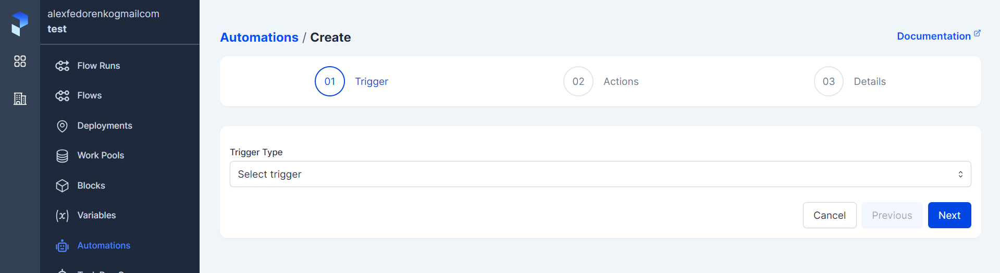

Answer: Actions


