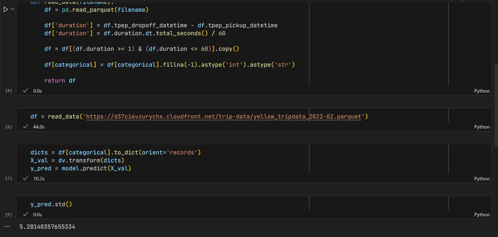
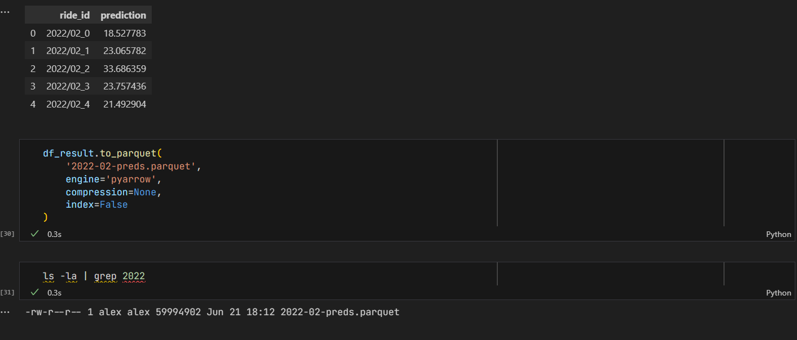
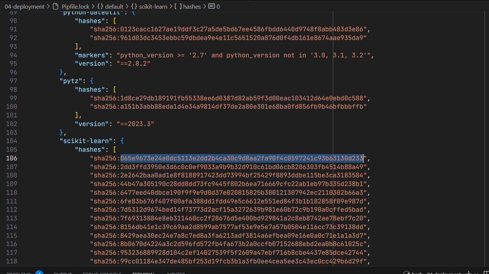
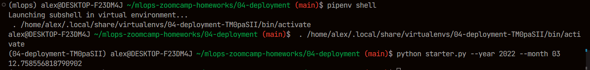
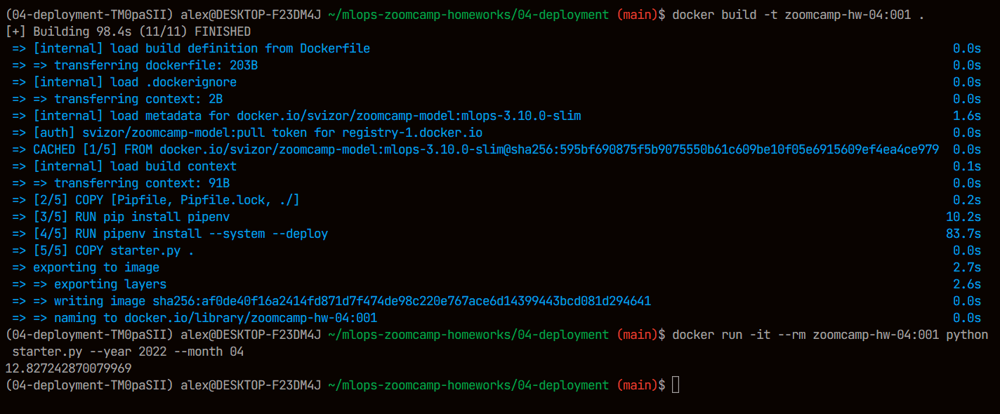

# Homework week 04 - deployment

## Q1. Notebook

What's the standard deviation of the predicted duration for the February 2022 data.?



Answer: 5.28

## Q2. Preparing the output

What's the size of the output file?



Answer: 58M


## Q3. Creating the scoring script

Now let's turn the notebook into a script. 

Which command you need to execute for that?

```
jupyter nbconvert --no-prompt starter.ipynb --to python
```

## Q4. Virtual environment


```
pipenv install scikit-learn==1.2.2 pandas click pyarrow --python=3.9
```

Answer: 065e9673e24e0dc5113e2dd2b4ca30c9d8aa2fa90f4c0597241c93b63130d233


## Q5. Parametrize the script

Let's now make the script configurable via CLI. We'll create two 
parameters: year and month.

Run the script for March 2022. 


```
python starter.py --year 2022 --month 03
```

What's the mean predicted duration? 

Answer: 12.76


## Q6. Docker container 

```
docker build -t zoomcamp-hw-04:001 .
docker run -it --rm zoomcamp-hw-04:001 python starter.py --year 2022 --month 04
```

 
Now run the script with docker. What's the mean predicted duration
for April 2022? 

Answer: 12.83
