# MLOps Zoomcamp Homeworks - Week 02 (MLFlow)

## Question 1


```
mlflow --version
```
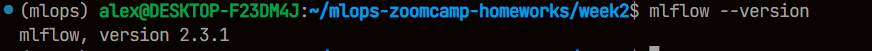

MLFlow version is 2.3.1

## Question 2

```sh
wget -P ./data https://d37ci6vzurychx.cloudfront.net/trip-data/green_tripdata_2022-{01,02,03}.parquet
python preprocess_data.py --raw_data_path ./data --dest_path ./output
ls -l ./output | grep dv
```

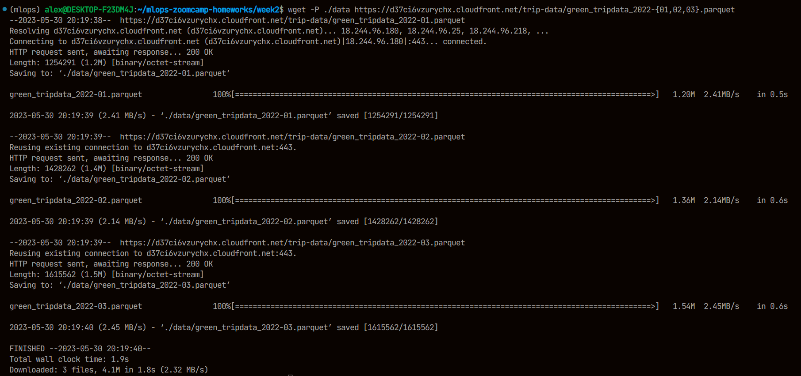
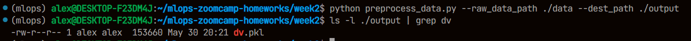

Size of `dv.pkl` is ~154 kB

## Question 3

```sh
python train.py
mlflow ui --backend-store-uri sqlite:///mlflow.db
```
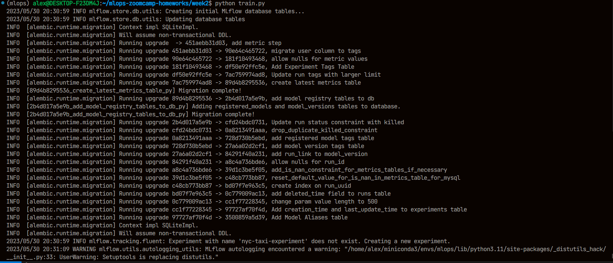
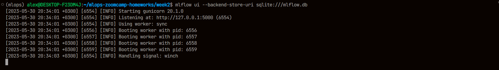
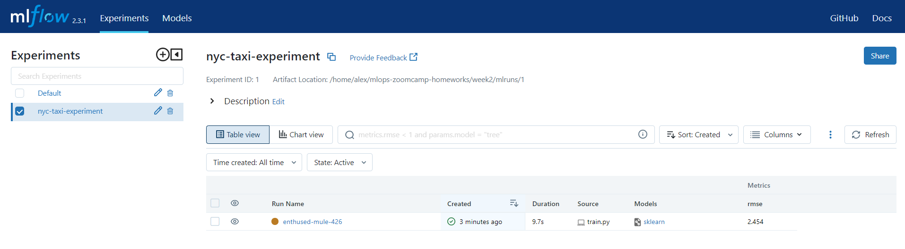
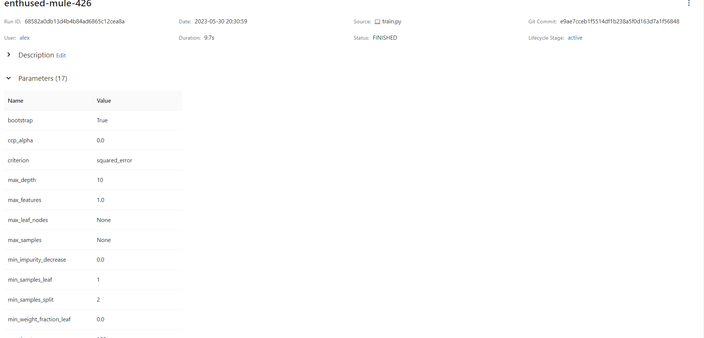

`max_depth` parameter is 10

## Question 4

```sh
mlflow server --backend-store-uri sqlite:///mlflow.db --default-artifact-root ./artifacts
python hpo.py
```

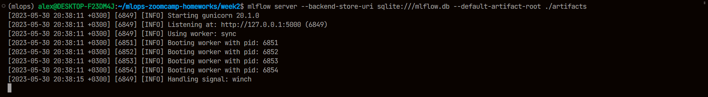
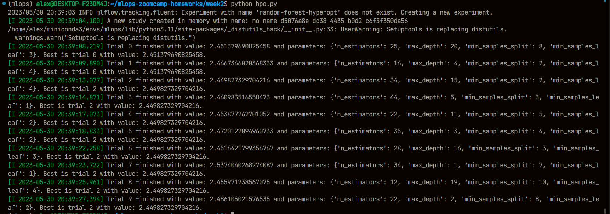
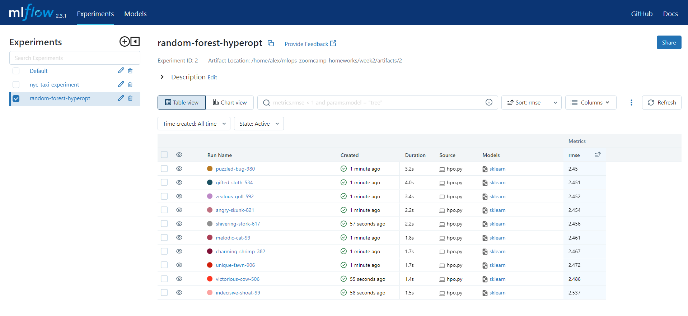

Best validation RMSE is 2.45

## Question 5

```sh
python register_model.py
```
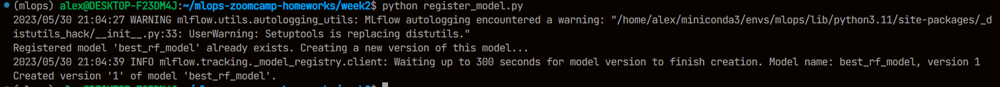
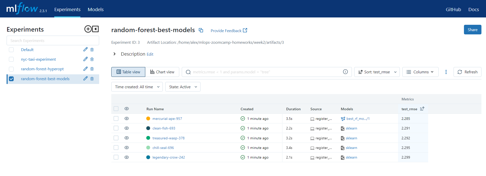
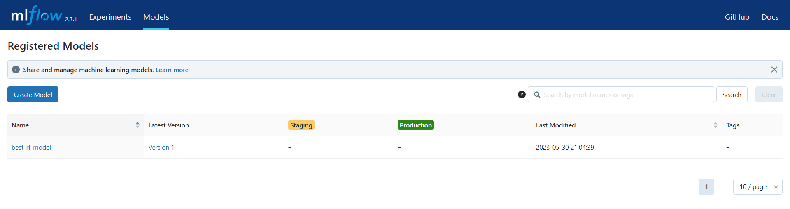

Best model test RMSE is 2.285

## Question 6

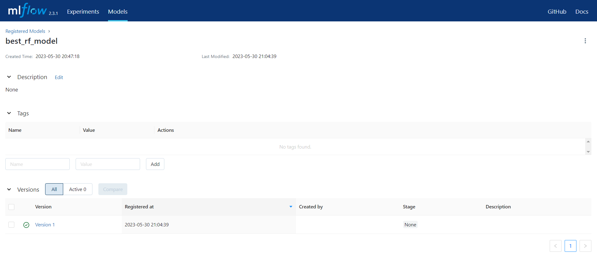

The registry contains only version number and source run, but no source experiment or model signature.


